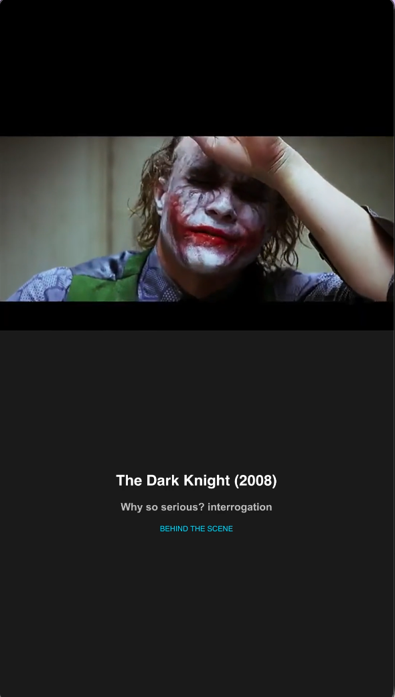
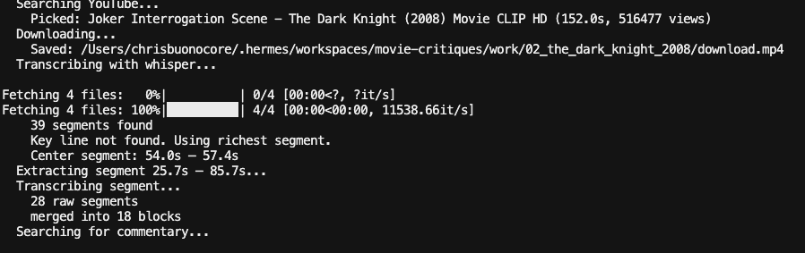

# movie-commentary

> **WIP** — Work in progress. Narration quality depends on the LLM model used.

Generate TikTok-style vertical videos (9:16) with movie scene clips and timed commentary overlays.

## Screenshots

| Intro card | Transcription in progress |
|---|---|
|  |  |

## How it works

```
YouTube → yt-dlp → ffmpeg segment → mlx-whisper (transcribe)
  → Web search → Grok narration → ffmpeg composite (9:16) → output.mp4
```

Each scene is transcribed locally, then commentary is generated via **Grok-4.3** (xAI API). The final video stacks the movie clip on top with timed narration text below in a continuous 5-line script.

## Requirements

- macOS with Apple Silicon (for mlx-whisper)
- ffmpeg (`brew install ffmpeg`)
- uv (`brew install uv`)

## Setup

```bash
git clone git@github.com:cbonoz/movie-commentary.git
cd movie-commentary
uv sync

# Optional: set up AI narration (highly recommended)
cp .env.example .env
# Edit .env with your xAI API key
```

### xAI API key (for Grok narration)

Get a key at [console.x.ai](https://console.x.ai). Without it, the tool falls back to generic template-based commentary.

```env
XAI_API_KEY=xai-...
XAI_MODEL=grok-4.3
```

## Usage

```bash
# Run scene N from scenes.csv
uv run movie-commentary make --scene 1

# Override duration
uv run movie-commentary make --scene 3 --duration 90

# Force full rebuild (clear caches)
uv run movie-commentary make --scene 2 --force

# Check cache status
uv run movie-commentary status --scene 1
```

## Output

Each scene is cached in `work/{rank}_{movie}_{year}/`:

| File | Description | Git-ignored |
|---|---|---|
| `download.mp4` | Original YouTube clip | yes |
| `segment.mp4` | Extracted scene segment | yes |
| `commentary_data.json` | Raw web search results | yes |
| `narration.json` | Grok-generated narration script | yes |
| `commentary.ass` | Timed subtitle overlay (ASS format) | yes |
| `output.mp4` | Final 9:16 TikTok video | yes |

Once generated, re-running a scene uses cached files (skip re-download, re-transcribe, re-API). Pass `--force` to rebuild from scratch.

## Scenes

`scenes.csv` ranks 40 iconic film scenes. Columns:

```
rank,movie,year,scene,key_line,themes,youtube_search,status
```

Update `status` from `pending` → `completed` after reviewing.

## Video layout

```
┌──────────────────────┐
│   (black padding)    │  ← 40px top
├──────────────────────┤
│                      │
│   Movie clip         │  ← 16:9, centered in top 50%
│                      │
├──────────────────────┤
│                      │
│   Narration lines    │  ← 5 timed phases, centered, 38px bold
│   (continuous,       │
│    fade transitions) │
│                      │
├──────────────────────┤
│  Movie — Scene       │  ← footer, 24px gray
└──────────────────────┘
```

- **Padding**: Top is black (`#000000`), bottom area is dark gray (`#1a1a1a`)
- **Intro card**: 0–5s shows movie title, scene name, "BEHIND THE SCENE" branding
- **Narration**: 5 lines, evenly spaced from 5s–60s, 250ms fade transitions
- **Footer**: Persistent scene label at very bottom

## Commands

| Command | Description |
|---|---|
| `make --scene N [--duration S] [--force]` | Generate a scene |
| `status --scene N` | Check cache state |

## Project structure

```
src/movie_commentary/
├── cli.py          # make + status commands
├── compositor.py   # ASS generation (timing, positioning, styles)
├── critic.py       # Web search + commentary scoring
├── downloader.py   # yt-dlp search + download
├── narrator.py     # Grok API fallback template narration
├── segmenter.py    # Whisper segment merging key line matching
└── transcriber.py  # mlx-whisper wrapper
```
